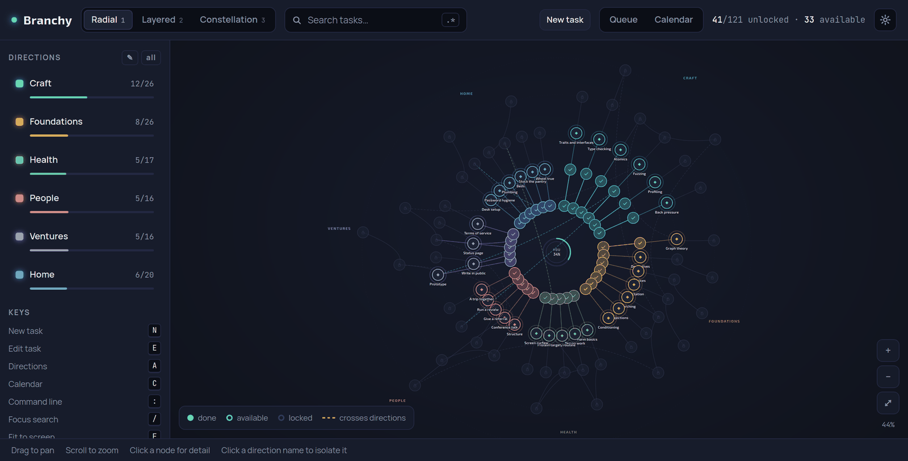

# Branchy

A dependency-aware, tree-alike TODO list. Break a goal into branches, unlock the next step as its prerequisites get done, and always see what is worth doing next.



> Status: the engine, a command line and a desktop window all work. Sync between devices is next.

## Idea

- Any item can depend on any other item, across branches, not only parent to child.
- An item is **locked** until its prerequisites are done, **available** once they are, and **done** when finished.
- A **deadline** on one item is inherited by everything it depends on, earliest wins. Date the goal and the whole chain leading to it is dated.
- The **tree view** shows the whole graph like a game skill tree. The **queue view** lists only what is available, ordered by priority.
- One graph for everything: work features that block each other, hard skills, health, any long-term plan.

Personal use first. PC first (Linux and Windows), mobile later.

## Try it

```sh
cargo run --bin branchy -- area "Hard skills" "#4fd1c5"
cargo run --bin branchy -- add "School algebra" pri 3
cargo run --bin branchy -- add "Calculus" after school pri 6
cargo run --bin branchy -- add "Probability theory" after calculus pri 8
cargo run --bin branchy -- done school

cargo run --bin branchy -- due "Probability theory" 2027-03-01

cargo run --bin branchy -- queue                     # what is available now
cargo run --bin branchy -- why "Probability theory"  # what stands in the way
cargo run --bin branchy -- calendar                  # what is due, and when
cargo run --bin branchy -- tree                      # the whole graph
cargo run --bin branchy -- undo                      # take the last change back
```

`after` and `needs` both mean "blocked by"; `before` and `blocks` say the same edge from the other end. Tasks are named by any unambiguous part of their name. `branchy where` prints the document's location, and `--file` points at another one.

## The window

```sh
cd src-tauri && cargo build && ./target/debug/branchy-desktop
```

The same graph, drawn as a skill tree. Three layouts, a queue and a calendar, search, task and direction editing, and the same command line behind `:` or Ctrl+K.

## Stack

- Rust, Cargo workspace.
- `crates/branchy-core`: graph, status, tiers, cycle handling, the command layer and its parser. No dependencies, no UI, no filesystem.
- `crates/branchy-app`: persistence, and the snapshot a user interface draws.
- `crates/branchy-cli`: the `branchy` binary.
- `ui/`: the frontend. Plain HTML, CSS and JavaScript, no build step.
- `src-tauri/`: the desktop shell.
- Next: file-based sync between devices, then Android.

## Roadmap

1. ~~Core crate.~~ Done.
2. ~~Desktop shell.~~ Done.
3. Sync between devices.
4. Android. iOS is out of scope for now.

The visual direction is in [docs/DESIGN_CONCEPT.md](docs/DESIGN_CONCEPT.md).

## Development

```sh
cargo fmt --all
cargo clippy --workspace --all-targets -- -D warnings
cargo test --workspace
```

CI runs the same three checks. Commit message rules are in [CONTRIBUTING.md](CONTRIBUTING.md).

## License

Licensed under either of [Apache License 2.0](LICENSE-APACHE) or [MIT license](LICENSE-MIT) at your option.
